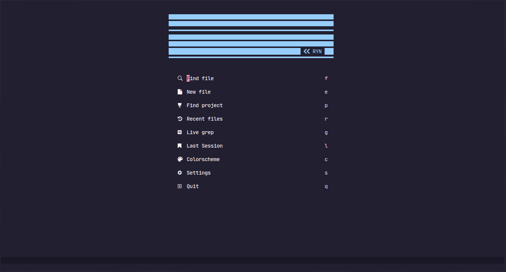

<h1 align="center">rynvim</h1>

<div align="center">


<a href="https://github.com/neovim/neovim">

</a>
</div>

## Pre-requisites

- Neovim (0.7.0+)
- Nerd Font
- ripgrep (optional)

## Install

> What you have to know? I do this on linux (void-linux--for-now), so idk how this configs work on other operating system like windows and mac. Here's is how to get this on linux.

1. Make sure to backup anything on `~/.config/nvim` if you need. Then just clone this repo.

```bash
git clone https://github.com/qqhgs/rynvim ~/.config/nvim --depth 1
```

2. Enter neovim `nvim` and you will got my message on command line (shortly, run `PackerSync` or press `space+p+s`). Or just enter neovim with `nvim +PackerSync` command.
3. Exit and enter neovim like usual. `nvim`

## Install Language support

- Enter `:LspInstall` followed by `<TAB>` to see your options for LSP

- Enter `:TSInstall` followed by `<TAB>` to see your options for syntax highlighting

## Todo

- [ ] Improve README
- [ ] Improve colorscheme [Rynkai](https://github.com/qqhgs/rynkai.nvim)
- [ ] Refactor
- [ ] Increase startuptime

## LICENSE
